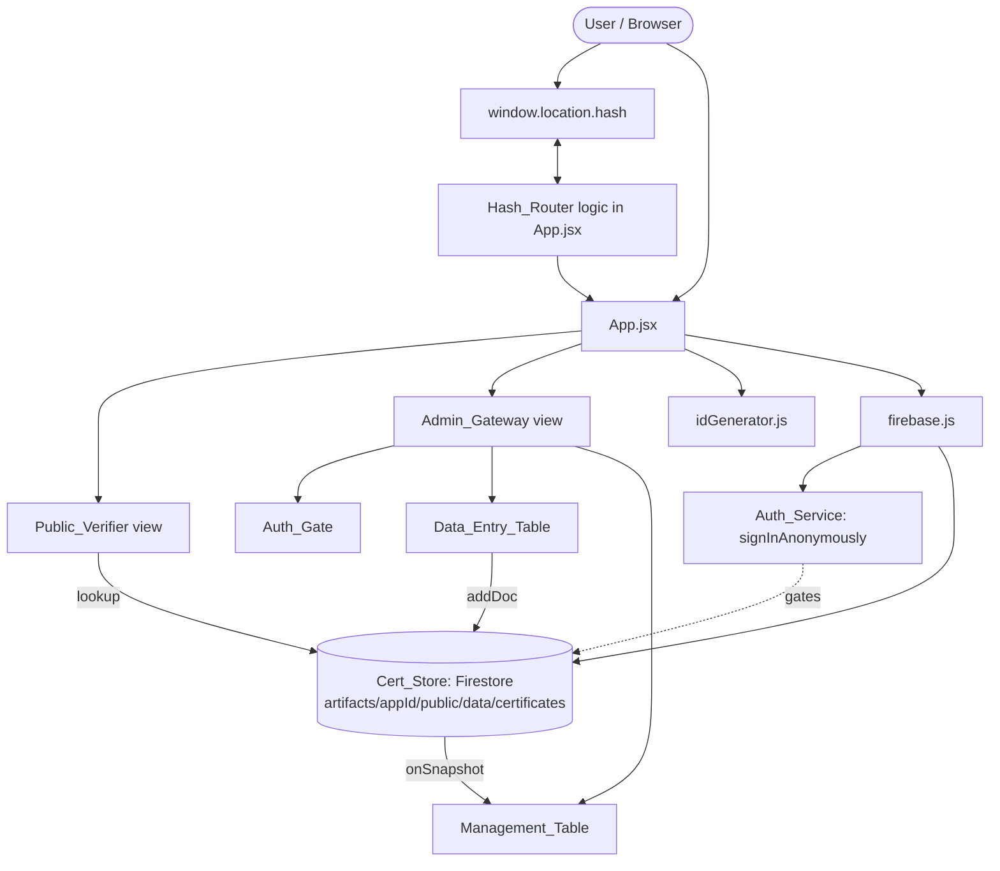
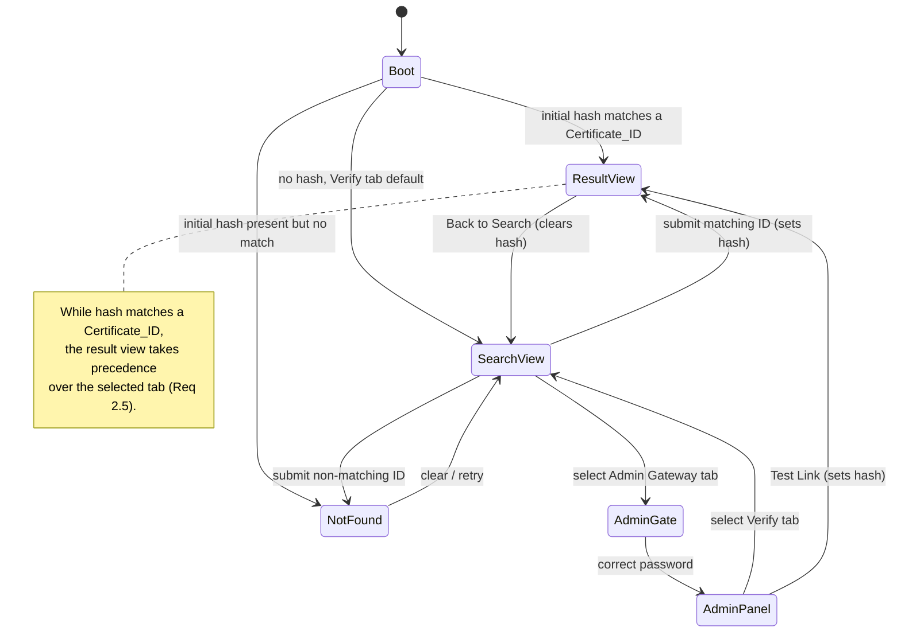

# Design Document

## Overview

The Certificate Verification Portal is a single-page React application (SPA) built with Vite, React (JavaScript / JSX), and Tailwind CSS. It serves two audiences from one page:

- **Public visitors** verify a certificate by entering its ID or by following a direct hash link.
- **Administrators** authenticate with a demo password, bulk-enter student data, persist certificates to Firebase Firestore, and manage/share existing certificate links.

The bulk of the UI and interaction logic lives in a single primary component, `App.jsx`, per the user's request. A small number of focused helper modules are extracted to keep pure logic testable and to isolate side-effectful Firebase setup:

- `src/firebase.js` — Firebase app/auth/firestore initialization from environment variables.
- `src/lib/idGenerator.js` — pure `Certificate_ID` generation logic.

Certificates are persisted in Firestore under `artifacts/{appId}/public/data/certificates` and streamed back to the admin UI through a real-time `onSnapshot` listener. Direct certificate links are powered by `window.location.hash`, so a URL like `https://host/#EDNWEB12345` shows the certificate result view immediately without a server round trip.

This project is created as a **new standalone project** and is intentionally kept separate from the unrelated existing `frontend` Verilog editor project.

**Requirements coverage:** This overview addresses the SPA framing of Requirements 1, 2, 3, 4, 5, 6, 7, 8, 9, and 10.

## Architecture

### Project Scaffolding

A new standalone project is scaffolded at the repository root in a directory named `certificate-portal/` (sibling to `frontend/`, `backend/`, `real-estate/`). It is a fresh Vite + React (JavaScript) project — **not** TypeScript — styled with Tailwind CSS.

Directory layout:

```
certificate-portal/
├── index.html
├── package.json
├── vite.config.js
├── tailwind.config.js
├── postcss.config.js
├── .env.example
├── .env                 # gitignored, developer-provided
├── .gitignore
└── src/
    ├── main.jsx         # React root mount
    ├── index.css        # Tailwind directives
    ├── App.jsx          # primary component (navigation, public verifier, admin gateway)
    ├── firebase.js      # Firebase init from env vars
    └── lib/
        └── idGenerator.js   # pure Certificate_ID generator
```

Key `package.json` characteristics:

- `"type": "module"`
- Dependencies: `react`, `react-dom`, `firebase`.
- Dev dependencies: `vite`, `@vitejs/plugin-react`, `tailwindcss`, `postcss`, `autoprefixer`, `vitest`.
- Scripts: `dev` (`vite`), `build` (`vite build`), `preview` (`vite preview`), `test` (`vitest run`).

Tailwind is configured with `content: ["./index.html", "./src/**/*.{js,jsx}"]`, and `src/index.css` contains the standard `@tailwind base; @tailwind components; @tailwind utilities;` directives.

### Environment Variable Handling

Firebase configuration is read from environment variables via Vite's `import.meta.env`. Vite only exposes variables prefixed with `VITE_` to client code, which is the supported mechanism for this client-only SPA. Note that Firebase web config values are not true secrets (they ship to the browser by design); the env-var approach keeps them out of committed source and lets different environments use different projects, satisfying Requirement 10.4.

Variables consumed:

- `VITE_FIREBASE_API_KEY`
- `VITE_FIREBASE_AUTH_DOMAIN`
- `VITE_FIREBASE_PROJECT_ID`
- `VITE_FIREBASE_STORAGE_BUCKET`
- `VITE_FIREBASE_MESSAGING_SENDER_ID`
- `VITE_FIREBASE_APP_ID`
- `VITE_APP_ID` — the logical `appId` used in the Firestore collection path `artifacts/{appId}/public/data/certificates`. Falls back to `"default-app-id"` when unset.

`.env.example` documents every variable with placeholder values and is committed; the real `.env` is gitignored.

**Requirements coverage:** Requirement 1.5 (Tailwind/responsive), Requirement 10.1, 10.4.

### High-Level Architecture Diagram



### Navigation / View State Flow



The defining architectural rule: a non-empty hash that matches a stored `Certificate_ID` always wins. View selection is computed as a derived value rather than stored as a single mutable "current screen" flag, so that hash precedence (Requirement 2.5) is honored regardless of the active tab.

## Components and Interfaces

All components below are rendered within `App.jsx`. They are described as logical sub-views; helper rendering may be inline functions or small local components within the same file to honor the "bulk of UI in App.jsx" constraint.

### App (primary component)

Responsibilities:

- Owns all application state (see Data Models → State).
- Initializes the hash listener and the Firestore real-time subscription via `useEffect`.
- Computes the derived active view (result view vs. search vs. admin) from hash + tab + auth state.
- Renders the top navigation bar and the active view.

### Top Navigation Bar

- Renders "Verify Certificate" and "Admin Gateway" tabs (Requirement 1.1).
- Clicking a tab updates `activeTab` state without a page reload (Requirements 1.2, 1.3, 1.4).
- Styled responsively with Tailwind down to 320px viewports (Requirement 1.5).

### Public_Verifier

Two visual states selected by derived view logic:

- **Search view**: centered card with a text input labeled "Enter Certificate ID" and a "Verify Now" button (Requirement 3.1). Submitting performs a trimmed-input guard (Requirement 3.4), a lookup against the in-memory certificate list / Firestore (Requirements 3.2, 3.3), and on match sets the hash (Requirement 3.5).
- **Result view**: see Certificate Result Display below.

Interface (logical functions inside App.jsx):

- `handleVerify(inputId)` → trims input; if empty, no-op; else looks up certificate; sets hash on match or shows not-found message.
- `lookupCertificate(id)` → returns the matching certificate object or `null`.

### Certificate Result Display

Renders the verified-certificate card (Requirement 4):

- White card, `rounded-[1.5rem]`, soft shadow (`shadow-xl`/`shadow-lg`) (4.1).
- Inline green checkmark SVG beside a stylized "Verified Certificate" heading (4.2).
- Fields ID, Name, Reg No, College, Domain, Period, Hours, each rendered as a row with a bold label using a consistent `min-w-[...]` (e.g. `min-w-[120px]`) so values align (4.3).
- Footer: gray italic text "If you believe this certificate is incorrect, contact" followed by a blue `mailto:internships@edunoversetechsolutions.com` link (4.4).
- "Back to Search" control at the top of the view that clears the hash (4.5, and 2.4).

### Admin_Gateway

Container that gates its content behind `Auth_Gate`:

- **Auth_Gate**: while not authenticated, shows only a password input and submit (Requirement 5.1). On submit, compares the entered value to `Admin_Password` (`admin2026`); equal → set `isAdminAuthed = true` (5.2); not equal → show authentication error message (5.3). The password constant is defined in source as a clearly labeled demo constant.
- **Data_Entry_Table** (shown after auth): editable grid (Requirement 6).
- **Management_Table** (shown after auth): live list of stored certificates (Requirement 9).

### Data_Entry_Table

- Columns: Student Name, Reg No, College, Domain, Period, Hours, and an Action column (Requirement 6.1).
- "Add Another Row" appends a row. If a preceding row exists, the new row copies College, Domain, Period, Hours from it (Requirement 6.2). If no preceding row exists, it appends an all-empty row (Requirement 6.4).
- Each row's Action column has a delete control that removes that row (Requirement 6.3).
- "Save to Cloud Database" triggers the save flow (Requirement 8).

Interface (logical functions):

- `addRow(rows)` → returns new rows array with an appended row (copy-from-previous or empty).
- `deleteRow(rows, index)` → returns new rows array without the row at `index`.
- `saveToCloud(rows)` → generates IDs and persists valid rows.

### Management_Table

- Lists every stored certificate showing ID, Name, Reg No, with "Copy Link" and "Test Link" controls per row (Requirement 9.1).
- Backed by a live Firestore `onSnapshot` subscription so changes propagate automatically (Requirement 9.2).
- "Copy Link" copies `window.location.href`'s base + `"#" + Certificate_ID` to the clipboard using `document.execCommand('copy')` against a temporary element, then shows a success Toast (Requirement 9.3).
- "Test Link" sets `window.location.hash` to the `Certificate_ID`, which the Hash_Router resolves into the result view (Requirement 9.4).

### Hash_Router (logic embedded in App.jsx)

- On mount, reads `window.location.hash` and registers a `hashchange` event listener (Requirements 2.1, 2.3).
- Exposes a pure parser `parseHash(hash)` → normalized certificate id string (strips leading `#`, trims).
- Derives the view: if the normalized hash is non-empty and matches a stored `Certificate_ID`, the result view is shown regardless of `activeTab` (Requirements 2.1, 2.5). If non-empty but no match, the not-found message is shown (Requirement 2.2).
- `clearHash()` sets `window.location.hash` to empty for "Back to Search" (Requirement 2.4).

### firebase.js

- Calls `initializeApp(firebaseConfig)` from `import.meta.env` values (Requirement 10.1).
- Exports `auth = getAuth(app)` and `db = getFirestore(app)`.
- Exports `appId` resolved from `VITE_APP_ID` (fallback `"default-app-id"`).
- Exports an `ensureAnonymousAuth()` helper that wraps `signInAnonymously(auth)` and resolves once authenticated.

### idGenerator.js

- Exports `generateCertificateId(domain, randomSource?)` (pure; see Data Models). Optional injectable random source for deterministic testing.

## Data Models

### Certificate

| Field   | Type   | Notes                                              |
| ------- | ------ | -------------------------------------------------- |
| id      | string | `Certificate_ID`, e.g. `EDNWEB12345`               |
| name    | string | Student name                                       |
| regNo   | string | Registration number                                |
| college | string | College name                                       |
| domain  | string | Internship/training domain                         |
| period  | string | Duration text (e.g. "June 2025 - August 2025")     |
| hours   | string | Hours text                                         |

Stored as a Firestore document under `artifacts/{appId}/public/data/certificates`. The Firestore document id may be auto-generated by `addDoc`; the `id` field holds the human-facing `Certificate_ID` used for lookup and links.

### Data Entry Row (transient, client-only)

```js
{
  name: "",     // Student Name
  regNo: "",    // Reg No
  college: "",  // College
  domain: "",   // Domain
  period: "",   // Period
  hours: ""     // Hours
}
```

### Application State (useState in App.jsx)

| State              | Type            | Purpose                                                        |
| ------------------ | --------------- | -------------------------------------------------------------- |
| `activeTab`        | `'verify' \| 'admin'` | Currently selected navigation tab (Req 1).               |
| `hash`             | string          | Mirror of normalized `window.location.hash` (Req 2).           |
| `searchInput`      | string          | Current value of the "Enter Certificate ID" field (Req 3).     |
| `searchError`      | string \| null  | Not-found / validation message for the search view (Req 3.3).  |
| `selectedCert`     | object \| null  | Certificate resolved for the result view (Req 4).              |
| `isAdminAuthed`    | boolean         | Whether the correct Admin_Password has been entered (Req 5).   |
| `passwordInput`    | string          | Current value of the Auth_Gate password field (Req 5).         |
| `authError`        | string \| null  | Authentication error message (Req 5.3).                        |
| `entryRows`        | array<Row>      | Rows in the Data_Entry_Table (Req 6).                          |
| `certificates`     | array<Certificate> | Live list from Cert_Store via onSnapshot (Req 9.2).         |
| `toast`            | string \| null  | Transient notification text (Req 9.3, 8.4, 10.3).              |
| `authReady`        | boolean         | True once anonymous auth succeeds; gates store ops (Req 10).   |
| `fatalError`       | string \| null  | Blocking error (auth failure) message (Req 10.3).              |

### Derived View Resolution (pseudocode)

```
normalized = parseHash(window.location.hash)
if normalized is non-empty:
    match = certificates.find(c => c.id === normalized)
    if match: view = RESULT(match)        # precedence over tab (Req 2.5)
    else:     view = NOT_FOUND             # (Req 2.2)
else if activeTab == 'admin':
    view = isAdminAuthed ? ADMIN_PANEL : AUTH_GATE
else:
    view = SEARCH
```

### useEffect Subscriptions

- **Auth effect** (runs once on mount): call `ensureAnonymousAuth()`. On success set `authReady = true`. On failure set `fatalError` and leave `authReady = false`, blocking store ops (Requirements 10.2, 10.3).
- **Firestore subscription effect** (runs when `authReady` becomes true): `onSnapshot(collection(db, 'artifacts', appId, 'public', 'data', 'certificates'))` → update `certificates` state. Returns the unsubscribe cleanup (Requirements 9.2, 8.3).
- **Hash effect** (runs once on mount): set initial `hash` from `window.location.hash`; add `hashchange` listener updating `hash`; cleanup removes the listener (Requirements 2.1, 2.3).

### ID_Generator Algorithm

```
generateCertificateId(domain, randomSource = Math.random):
    letters = uppercase(domain) filtered to A-Z characters
    prefixLetters = first 3 of letters   # may be fewer than 3 (Req 7.2)
    digits = 5 characters, each = floor(randomSource() * 10) in 0..9  # (Req 7.3)
    return "EDN" + prefixLetters + digits
```

Examples: domain `"Web Development"` → letters `WEBDEVELOPMENT` → `EDNWEB#####`; domain `"AI"` → `EDNAI#####` (only two letters, Req 7.2); domain `"3D"` → letters `D` → `EDND#####`.

## Correctness Properties

*A property is a characteristic or behavior that should hold true across all valid executions of a system — essentially, a formal statement about what the system should do. Properties serve as the bridge between human-readable specifications and machine-verifiable correctness guarantees.*

The following properties were derived from the prework analysis. Pure logic (ID generation, row transforms, view/hash resolution, auth predicate, link building, save row-selection) is well suited to property-based testing. Static rendering, styling, and Firebase/infrastructure wiring are covered by example, snapshot, and integration tests in the Testing Strategy instead.

### Property 1: Certificate ID format and prefix correctness

*For any* domain string and any random source, `generateCertificateId(domain)` produces a string of the form `"EDN"` + the first up-to-three uppercased alphabetic letters of the domain + exactly five characters each in the range `0`–`9`; the letter segment equals the uppercase of the first three alphabetic characters of the domain (or all available alphabetic characters when fewer than three exist).

**Validates: Requirements 7.1, 7.2, 7.3**

### Property 2: Add Another Row copies carry-over fields from the preceding row

*For any* array of data-entry rows, `addRow(rows)` returns an array whose length is one greater, where the appended row's College, Domain, Period, and Hours equal those of the previously last row (or are empty when no preceding row exists), and the appended row's Student Name and Reg No are empty.

**Validates: Requirements 6.2, 6.4**

### Property 3: Delete row removes exactly the targeted row

*For any* array of data-entry rows and any valid index, `deleteRow(rows, index)` returns an array with length one less, excluding only the row at that index while preserving the relative order and contents of all other rows.

**Validates: Requirements 6.3**

### Property 4: Admin authentication predicate

*For any* string input, the Auth_Gate grants access if and only if the input is exactly equal to the Admin_Password (`admin2026`).

**Validates: Requirements 5.2, 5.3**

### Property 5: Hash resolution and tab precedence

*For any* set of stored certificates, any selected navigation tab, and any hash value, the view resolver returns the result view for the certificate whose `Certificate_ID` equals the normalized hash when such a certificate exists (regardless of the selected tab), returns the not-found view when the normalized hash is non-empty but matches no certificate, and otherwise defers to the selected tab.

**Validates: Requirements 2.1, 2.2, 2.5, 3.2, 3.3, 9.4**

### Property 6: Empty or whitespace search input is rejected

*For any* string consisting solely of whitespace (including the empty string), submitting the verification form performs no lookup, sets no hash, and retains the search view.

**Validates: Requirements 3.4**

### Property 7: Share link round-trips through hash parsing

*For any* base page URL and any `Certificate_ID`, `parseHash(buildShareLink(baseUrl, id))` returns the original `Certificate_ID`; that is, building a share link as base + `"#"` + id and then parsing the hash recovers the id.

**Validates: Requirements 3.5, 9.3**

### Property 8: Result view renders all certificate fields

*For any* certificate object, the certificate result view renders the values of all seven fields — ID, Name, Reg No, College, Domain, Period, and Hours.

**Validates: Requirements 4.3**

### Property 9: Management listing renders identity fields and controls for every certificate

*For any* list of stored certificates, the Management_Table renders, for each certificate, its ID, Name, and Reg No along with a Copy Link control and a Test Link control.

**Validates: Requirements 9.1**

### Property 10: Save persists exactly the valid rows with generated IDs

*For any* array of data-entry rows, the save operation persists exactly those rows whose Student Name is non-empty, assigning each a well-formed `Certificate_ID`, and persists no row whose Student Name is empty.

**Validates: Requirements 8.1, 8.2**

## Error Handling

- **Empty/whitespace search (Req 3.4):** `handleVerify` trims the input and returns early when empty, leaving the search view and clearing any prior error or showing a gentle validation hint. No hash mutation occurs.
- **Certificate not found (Req 2.2, 3.3):** When a submitted or hash-supplied id matches no certificate, the not-found message "Invalid Certificate Link or not found." is rendered in red. The application remains usable; the user can retry or use Back to Search.
- **Wrong admin password (Req 5.3):** A non-matching password sets `authError` with a clear message and leaves `isAdminAuthed = false`; the management interface stays hidden.
- **Persistence failure during save (Req 8.4):** `saveToCloud` persists rows sequentially; if any `addDoc` rejects, the loop halts immediately, no further rows are written, and a failure Toast/error notification is shown so the administrator can retry. Already-written rows in that batch are not rolled back (Firestore has no client transaction across this loop) — this is surfaced honestly in the error message.
- **Anonymous auth failure (Req 10.3):** If `signInAnonymously` rejects, `authReady` stays false, `fatalError` is set with an error notification, and the Firestore subscription and all save operations are blocked until authentication succeeds. The auth effect may retry on remount.
- **Missing/invalid Firebase env config:** If required `VITE_FIREBASE_*` values are absent, initialization surfaces a clear console/UI error rather than failing silently; `.env.example` documents the required set.
- **Clipboard copy fallback (Req 9.3):** Copy uses a temporary textarea + `document.execCommand('copy')` for broad compatibility; if the copy command reports failure, an error Toast is shown instead of a success Toast.

## Testing Strategy

The project uses **Vitest** as the test runner. Pure logic is unit- and property-tested directly; React views use example/rendering tests (via `@testing-library/react` + `jsdom`); Firebase interactions use mocks. Property-based tests use **fast-check** (the standard JS property testing library) — property testing is not implemented from scratch.

### Property-Based Tests

Each correctness property maps to a single property-based test configured to run a minimum of **100 iterations**. Each test is tagged with a comment referencing its design property in the format:

`// Feature: certificate-verification-portal, Property {number}: {property_text}`

Targets and approach:

- **Property 1 (ID format):** `fast-check` string generators for domains (including letterless and short domains); inject a deterministic random source to assert the digit segment and validate the letter prefix and overall regex `^EDN[A-Z]{0,3}\d{5}$` with prefix-length matching available letters.
- **Property 2 (addRow):** generate arrays of rows (including empty); assert carry-over fields and emptied name/regNo, length +1.
- **Property 3 (deleteRow):** generate rows + a valid index; assert exact removal and order preservation.
- **Property 4 (auth predicate):** generate arbitrary strings plus the literal password; assert grant iff equal.
- **Property 5 (hash resolution & precedence):** generate certificate sets, a tab value, and a hash (sometimes matching, sometimes not); assert the resolver output matches the specification including tab precedence.
- **Property 6 (whitespace guard):** generate whitespace-only strings; assert no lookup/no hash change.
- **Property 7 (share link round trip):** generate base URLs and ids; assert `parseHash(buildShareLink(...))` recovers the id.
- **Property 8 (result-view completeness):** generate certificates; render the result view; assert all seven field values appear.
- **Property 9 (management-row completeness):** generate certificate lists; render the table; assert id/name/regNo and both controls per row.
- **Property 10 (save selection):** generate rows including empty-name ones; run `saveToCloud` with a mocked store; assert exactly the valid rows are persisted with well-formed ids.

### Example / Unit Tests

- Navigation rendering: two tabs present; tab switching shows the correct view (Req 1.1–1.4).
- Search card structure: labeled input + "Verify Now" button (Req 3.1).
- Result view styling/content: white `rounded-[1.5rem]` shadowed card, green checkmark SVG, "Verified Certificate" heading, gray italic footer + blue mailto link, Back to Search control (Req 4.1, 4.2, 4.4, 4.5).
- Back to Search clears hash → search view (Req 2.4).
- Hashchange listener updates the view (Req 2.3).
- Auth_Gate hides management while unauthenticated (Req 5.1).
- Data_Entry_Table column headers present (Req 6.1).
- Edge case: `addRow([])` yields one all-empty row (Req 6.4).
- Edge case: persistence failure halts save and shows error Toast (Req 8.4).
- Copy Link triggers `execCommand('copy')` and shows success Toast (Req 9.3).

### Integration / Smoke Tests (mocked Firebase)

- `onSnapshot` emission updates the live certificate list (Req 9.2).
- Store operations are gated until anonymous auth resolves; auth failure sets `fatalError` and blocks reads/writes (Req 10.2, 10.3).
- Firestore writes target collection path `artifacts/{appId}/public/data/certificates` (Req 8.3).
- `initializeApp` is invoked with config sourced from `import.meta.env`; no literal keys in source (Req 10.1, 10.4).
- SPA renders without full-page reloads; responsive layout verified manually at 320px (Req 1.4, 1.5).

### Notes

- Property tests focus on universal correctness of pure logic; example tests cover concrete UI structure and styling; integration tests with mocks cover Firebase wiring without incurring real network cost.
- Firebase config values are not secrets but are kept in env vars per Requirement 10.4; tests run against mocks and never require a live project.
